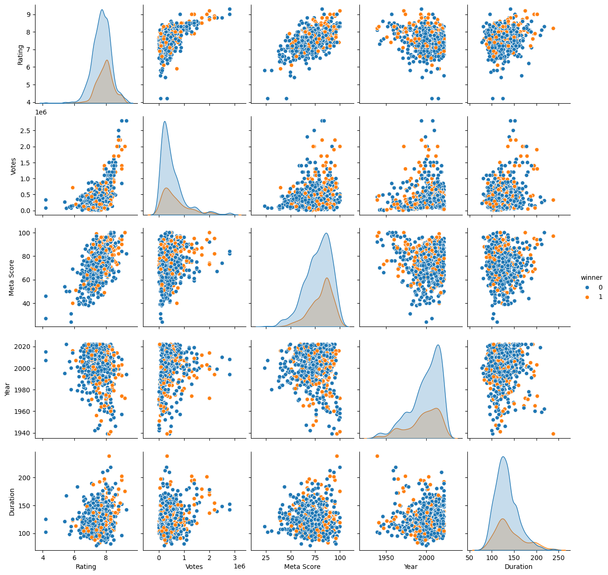
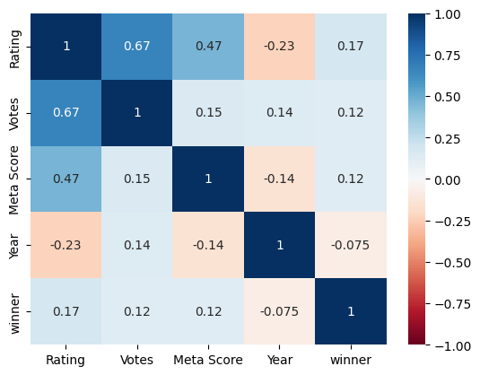
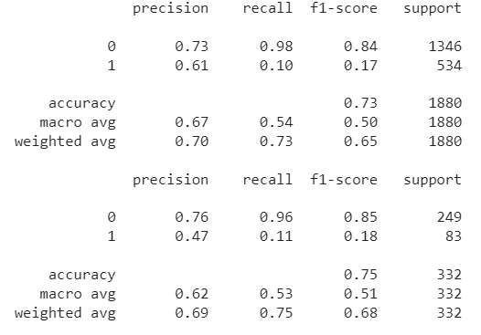
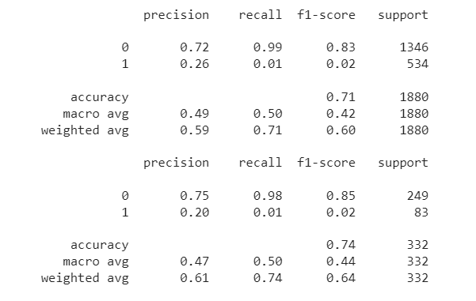
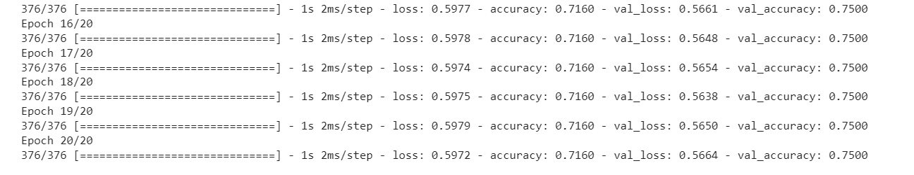

CSE 151A Final Project Report

**A. Introduction**

Our group chose to analyze whether or not a movie can be predicted to be
nominated for the Oscars, based on the year it came out, ratings, cast,
director, and genre. We wanted to work with movie datasets, as it was
something that interested everyone in the group. After analyzing various
datasets available on Kaggle and other websites, we picked our unique
topic, which utilized a past Oscar nominations dataset and IMDB movie
dataset. Analyzing this data and creating models would allow us to find
better movies to watch if we can predict whether a movie will be
considered for the Oscars. Since Oscar nominations are known to
generally be "good" movies, based on various factors, this project could be useful for finding good movies to watch.

**B. Figures**

> 
>
> *Figure 1 - Pair plot of the cleaned dataset*
>
> The pair plot shows the correlation between the \`\`\`Year\`\`\`,
> \`\`\`Meta Score\`\`\`, \`\`\`Votes\`\`\`, \`\`\`Rating\`\`\` columns
> and how they relate to the \`\`\`winner\`\`\` column.
>
> 
>
> *Figure 2 - Heatmap of the cleaned dataset*
>
> The heatmap shows the correlation between \`\`\`winner\`\`\`,
> \`\`\`Year\`\`\`, \`\`\`Meta Score\`\`\`, \`\`\`Votes\`\`\`,
> \`\`\`Rating\`\`\`. The strongest correlation is seen between
> \`\`\`Votes\`\`\` and \`\`\`Rating\`\`\`.

**C. Methods**

I.  **Data Exploration**

> For data exploration, our first step was to combine the two datasets
> we used by \`\`\`
>
> agg_data = pd.merge(imdb_data, oscar_data, left_on=\'Movie Name\',
> right_on=\'film\')\`\`\`. We fixed typos and dropped unnecessary or
> redundant columns after the merge. We also removed rows where the
> \`\`\`Year\`\`\` and \`\`\`year_film\`\`\` didn't match up, to avoid
> dealing with data where there are different movies with the same name
> in the dataset. Afterward, we converted the \`\`\`duration\`\`\`
> column from hours to minutes, with a method we created. We also made
> another method to convert the \`\`\`winner\`\`\` column that contained
> boolean values to integers-- ones and zeros. We were able to find the
> unique entries given in the categorical columns by \`\`\`unique_genres
> = agg_data\[\'Genre\'\].str.split(\', \').explode().nunique()\`\`\`.
> We also found what entries contained null data, which we decided was
> best to drop those specific rows with \`\`\`agg_data =
> agg_data.dropna()\`\`\`, to get a dataset with no null values. Lastly,
> we plotted the dataset as a pair plot, a pair plot centered around the
> \`\`\`winner\`\`\` column, and a heatmap to analyze the data.

II. **Preprocessing**

> To further preprocess our data, we encoded the \`\`\`Genre\`\`\` and
> \`\`\`PG Rating\`\`\` columns with one-hot encoding to further expand
> our dataset with valuable information using the \`\`\`mlb =
> MultiLabelBinarizer()\`\`\`. For the \`\`\`PG Rating\`\`\` column, we
> renamed all the encoded columns to be shortened, so we do not have to
> deal with longer and complex column names. We also normalized our data
> using the min-max normalization technique on the \`\`\`Rating\`\`\`
> and \`\`\`Meta Score\`\`\` columns to get the values in these columns
> between zero and one. We also split the data so that
> \`\`\`winner\`\`\` is the dependent variable we are classifying in
> this project. We split this data into training and testing sets with a
> ratio of 85:15 as so:
>
> \`\`\`X = agg_data.drop(\[\'winner\', \'Movie Name\', \'Cast\',
> \'Director\', \'category\', \'name\'\], axis = 1)
>
> Y = agg_data\[\'winner\'\]
>
> X_train, X_test, y_train, y_test = train_test_split(X, Y, test_size =
> 0.15, random_state = 21)\`\`\`.

III. **Model 1**

> For model 1, we wanted to create a Linear Regression model. We used
> the LinearRegression function from the sklearn library to fit the
> training data, like so \`\`\`reg = LinearRegression()
>
> regmodel = reg.fit(X_train, y_train)\`\`\`. We created our prediction
> values for the training and testing sets and printed classification
> reports based on these. Lastly, we were also able to acquire the mean
> squared error values for both the training and testing sets to check
> for overfitting.

IV. **Model 2**

> For model 2, we created a Logistic Regression model. We fit the
> training data into the Logistic Regression model, like so \`\`\`logreg
> = LogisticRegression()
>
> logreg.fit(X_train, y_train)\`\`\`. Just like in model 1, we obtained
> prediction values, classification reports, and mean squared error
> values for the training and testing sets.

V.  **Model 3**

> For model 3, we created a neural network. We used a sequential model
> and placed 5 layers within it. The hidden layers, including the input
> layer, all had 64 units with the activation function of
> \`\`\`relu\`\`\`. The output layer had the sigmoid activation
> function. We attempted to work with various activation functions--such
> as \`\`\`tanh\`\`\` --, node values, and hidden layers to achieve the
> best accuracy. This was our finalized model: \`\`\`nn_model =
> Sequential()
>
> ACTIVATIONFXN = \'relu\'
>
> nn_model.add(Dense(units = 64, activation = ACTIVATIONFXN, input_dim =
> X_train.shape\[1\]))
>
> nn_model.add(Dense(units = 64, activation = ACTIVATIONFXN))
>
> nn_model.add(Dense(units = 64, activation = ACTIVATIONFXN))
>
> nn_model.add(Dense(units = 64, activation = ACTIVATIONFXN))
>
> nn_model.add(Dense(units = 1, activation = \'sigmoid\'))\`\`\`.
>
> We compiled the model with the \`\`\`rmsprop\`\`\` optimizer and the
> loss function of \`\`\`binary_crossentropy\`\`\` since this is not
> multiclass. We ran this for 20 epochs to get our results. Afterward,
> we were able to compare the errors between the training and testing
> data and graph it in the fitting graph.

**D. Results**

I.  **Model 1**

> The linear regression model was not very accurate (accuracy around
> 0.75 for the testing dataset and 0.73 for the training dataset), and
> this ended up being our best
> model.

> 

II. **Model 2**

> The logistic regression model had a slightly worse accuracy, compared
> to the first model (accuracy around 0.75 for the testing dataset and
> 0.72 for the training dataset). This model did not improve from the
> first model we tested.
>
> 

III. **Model 3**

> The neural network model performed about the same as the second model
> (accuracy 0.75 for the testing dataset and 0.716 for the training
> dataset)
>
IV. **Model 4**
> After running out models since we had done analysis on our data and pre-processed 
> our data. We decided to try other models to see if they could learn how to classify 
> something beyond the baseline. KNN and Soft Decision Trees were attempted but
> performed worse than other models. The only model that was able to learn how to classify any 1’s ended up being a Random 
> Forest Classifier. It achieved an accuracy of 77. Higher than all the other models. Once again, we stipulate that this is of marginal > significance. It is still true we could find creative ways to solve this problem. We did not try a pipeline to see if chaining models 
> together could be a better solution. Also, we could do more EDA and see if one hot encoding and running our model could lead to > a better performance. 

RandomForestClassifier(max_depth=40, min_samples_leaf=4, min_samples_split=20,
                       n_estimators=500, random_state=42)

> 
>
> However, something we\'ve noticed was that our neural network
> predicted all 0s. This is saying that there is no meaning in the
> predictions and that the around 75% accuracy was because there were
> only 25% of winners in the test data set, and if we predicted all 0s
> then the accuracy would be 75% because 75% of the movies didn\'t win
> the oscar.
>
> That being said, our neural network model wasn\'t predicting anything,
> and there isn\'t something we can do to improve this model. In
> conclusion, we can see that there might not be any sort of patterns
> the neural network model was able to learn and predict what kinds of
> movies would win the Oscar.

**E. Discussion**

I.  **Data Exploration and Motivation**

> Our project embarked on an exploratory analysis to understand and
> predict Oscar rewards using a dataset combining IMDb and Oscar data.
> The motivation behind this study is uncovering the hidden patterns
> within cinematic achievements and their recognition at one of the most
> prestigious award ceremonies worldwide. We are not only aiming to
> predict Oscar winners but also to gain insights into which factors
> contribute to such wins.

II. **Preprocessing**

> We start with data cleaning and preprocessing, ensuring the integrity
> and usability of the data. The handling of missing values,
> normalization, and one-hot encoding of categorical variables were
> performed. These steps were fundamental in preparing the dataset for
> machine learning models, underscoring the importance of data
> preprocessing.

III. **Model 1**

> Linear Regression was the first model we built. Although typically
> used for continuous outcome prediction, it served as a baseline for
> understanding the linear relationship between the features and the
> binary outcomes of winning an Oscar results, while providing some
> insight of high recall and acceptable(75%) precision in evaluation.
> The performance of this linear regression model implies us to shift
> our exploration on models that are better suited for binary
> classification.

IV. **Model 2**

> Logistic Regression was subsequently chosen for its appropriateness
> for binary outcomes. It offered an improvement in understanding the
> relationship between features and the Oscar binary results through the
> lens of odds ratios converted from the logistic function. Despite its
> theoretical suitability, the practical performance did not
> significantly outshine the baseline model, as indicated by achieving
> high precision and recall for Oscar winners only(25% of the whole
> dataset).

V.  **Model 3**

> After exploring logistic regression, which continues to fall short in
> accurately classifying Oscar winners, our attention turned to
> utilizing more sophisticated methods capable of handling the
> complexity of the dataset. Gradient descent, specifically using ReLU
> and Softmax activation functions, was chosen because of the need to
> explore nonlinear relationships in the data that simpler models could
> not adequately capture.
>
> We expected this model could stand out for its potential in deep
> learning applications, where its ability to optimize complex cost
> functions and handle multiple layers of abstraction can reveal
> previously ambiguous patterns and insights. However, the performance
> of evaluation metrics of this model shows a slightly lower accuracy
> than previous two models.
>
> While the model was initially expected to provide deeper insights, its
> predictions were predominantly zero, suggesting that an Oscar winner
> was not very likely. This result suggests that the accuracy of the
> model is only cosmetic and comes not from the predictive power of the
> model but from inherent distribution of the dataset in which
> approximately 75% of the movies did not win an award. Thus, the
> seemingly high accuracy of our model simply reflects the underlying
> probability of not winning an Oscar.
>
> This finding is crucial in that it emphasizes a key limitation of our
> approach. Fundamentally, the model does not provide meaningful
> predictions; it reflects the dataset's bias against non-winners. This
> finding prompted us to reevaluate our expectations and methodology in
> the future. It revealed the complexity of capturing the essence of
> Oscar-winning attributes through machine learning, emphasizing the
> need for more sophisticated models or richers datasets to reveal any
> predictive patterns that truly indicate Oscar winners potentials.

VI. Model 4

As our data had been preprocessed and everything was basically plug in play. We were interested in experimenting with different models to try to improve accuracy. Since we knew our baseline performance was 75\%. We knew we needed to train and get the model to consider and learn other features to predict something else beside’s zero. So we eventually landed on a Random Forest Classifier, due to the averaging/bagging of multiple trees and the reduction in overfitting, Random Forest can achieve higher accuracy than individual decision trees. Random Forest can provide insights into which features are important in making predictions, which can be useful for feature selection and understanding the problem better.

VII. **Evaluation and Reflection**

> There are many potential reasons for why the model's were unable to
> predict the Oscar winners. One potential reason is that the awards are
> given randomly and that there aren't certain trends between winners
> and losers. It is important to note that the committee that selects
> the nominees and winners changes year to year, and each person may
> have certain standards for what constitutes a good movie. Moreover,
> each person votes based on their subjective opinion, not some
> quantitative metric. Therefore, it could be difficult for a model to
> quantify the boundaries for which movies become winners and losers.
> Another potential reason is that there wasn't more variety of data.
> From preprocessing it is clear that none of the attributes had a
> strong correlation to Oscar outcome. There could be other metrics out
> there that might have had a better correlation which would have been
> more useful for our model. Going forward it is important to take these
> reasons into consideration when evaluating a new model.

**F. Conclusion**

Our models were not successful at predicting the Oscar winners with the
given data. Our neural network just defaulted to predicting that every
film would not win, which is something that we do not need a model to
do. Even though this returned a somewhat respectable accuracy (75%), it
was only because most of the films in the dataset were not winners.
Since every model that we tried was unsuccessful, this indicates that
there was not much we could have done differently as there seems to be
very little pattern as to which films end up winning Oscars, at least
based on the film information from IMDb. This seems to make sense as so
few films win Oscars in the first place and there are many quality films
that are nominated but do not win, so picking out the winners is
difficult, if not impossible.

If we could do future projects, then it would be better to pick a target
that is more likely to yield results. For example, we could potentially
try to identify not just the winners, but all of the films that were
nominated. This would give us a larger number of targets and a greater
chance of building a model that would be able to discriminate between
each class. We also might want to limit which category we try to
predict. For this project, we did not do that, so a film that won an
Oscar from any category (Best Picture, Best Animated Feature, Best
Visual Effects, etc.) was lumped in with every other winner. If we focus
on a single category, like Best Picture, then it might be more likely
that we find a pattern that could be borne out in the data.

**G. Collaboration** 

Albert Ai:

Samantha Lin: Project manager, Coding, writer: organized some meetings,
helped with coding during data preprocessing, worked with others to code
the first model, contributed in model 2, coded the third model, was a
part of writing the conclusions for model 1, wrote the conclusion for
model 3, and worked on the results section for the final report.

Housheng Hai: coding, writer: helped with finding appropriate dataset
during data exploration and coding during exploratory data analysis.
Contributed in testing and coding for model 1&2. Writing and organizing
the discussion section for the final report.

Diya Thomas: Project Manager, Coding, Writer: Reached out to the group
and made our Discord chat to work on the project and created when2meets;
selected some meeting times and created documentation; helped with
coding during group meetings; debugged coding errors we ran into and
organized the code; worked on the introduction, figures, and methods
sections in the report

Dhruv Wadhwa: Coding, writer: Helped writing code during the data
exploration and preprocessing as well as during the first model. Also
wrote one of the conclusion sections for the model explaining our
results.

Adhithya Ananthan: Coding, Writer: Helped with writing code during data
exploration and preprocessing. Specifically, found the number of unique
values in the dataset and cleaned up the dataset by adding one-hot
encoding, fixing repeated values, removing null values, and converting
strings to lists for certain columns. Helped write some of the initial
write ups and write evaluation and reflection section of the discussion
part of the final report.

James Cole: Coding, Writer: Helped with coding and brainstorming during
the group meetings for finding the datasets, data preprocessing, and
creating models; contributed to the writing for the early milestones and
wrote the conclusion of the final project.

Carlos Monterosa: Coding, Writer: Helped with coding and preprocessing
data. Assisted in coming up with metrics to evaluate our model. Ran and
debugged some code but my teammates were way ahead of me.
